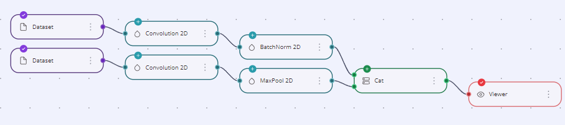
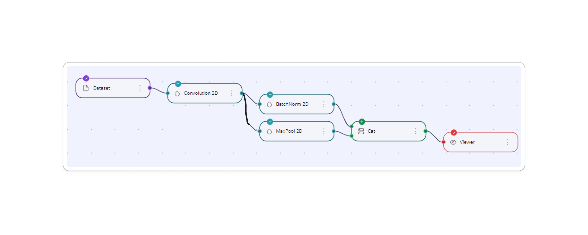
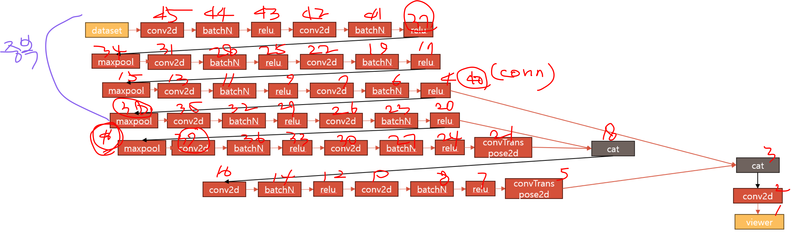
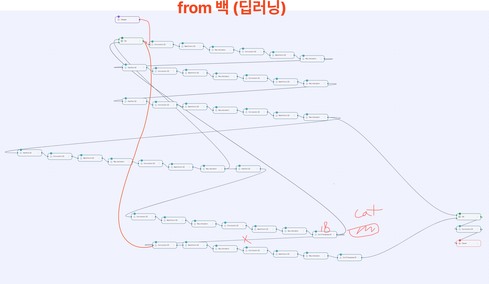
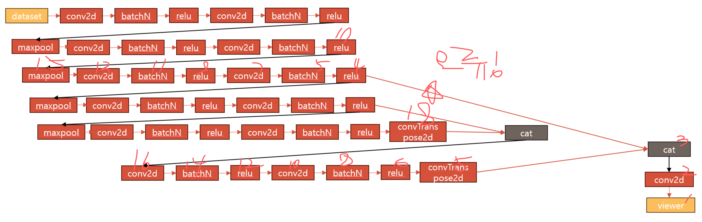

# rete 관련

## 수십만번의 uncaught cancelled error

- cancelled: rete 의 dataflow engine이 fetch중에 reset 되었을 때
- 원인:
  - process 함수: node의 connection이 변경될때마다 실행됨

  ```jsx
  const process = () => {
    engine.reset()
    editor
    .getNodes()
    .forEach(node => {
      await engine.fetch(node.id);
    })
  };
  ```

  - reset 함수: 노드 실행이 반복적으로 수행되는 것을 피하기 위해 노드의 결과값들이 캐시되므로 이 캐시를 지워주는 과정이 필요한 것임
  - fetch 함수: fetch는 타겟 노드 (a-b 연결되어있으면 b노드)에서부터 모든 자손 노드들을 그래프 순회하며 노드의 data() 를 실행시킴
  - data 함수:
     input 노드로부터 인자를 받아옴
     output을 return 함
     다음에 연결될 노드의 input 인자로 전달됨

- 해결 및 결과: process()함수의 trigger인 connection의 생성과 삭제를 감지하기 위한 addPipe 함수를 노드가 모두 생성되고 난 뒤에 실행하도록 변경하여 최초 로딩 속도를 1.6초에서 1.0초로 감소 시킴
  
## 데이터를 활용한 노드 생성 자동화

### 자체적으로 만든 데이터 구조로 부터 노드를 생성

vience-mlops 의 노드 간 데이터 교환은 input으로 연결된 모든 노드의 정보가 input이라는 객체 안에 재귀적으로 전달되도록 설계되어 있는데요. 이를 통해서 노드를 생성함으로써 많은 양의 노드들을 빠르게 생성할 수 있습니다.


예를 들어서 위의 이미지와 같이 연결된 세 개의 노드가 있을 때,

```json
{
  "datasetPath": { // 모든 노드가 공유
  },
  "nodes": {
    "input": [// 세 번째 노드
      {
        "input": [ // 두 번째 노드
          { 
            "input": [ // 첫 번째 노드
              "dff4b305254cce94"
            ],
            "node": {
              "dataset": {
                "nodeId": "be7b3f5e3a788272",
              }
            }
          }
        ],
        "node": { // 두 번째 노드
          "convolution2d": {
            "nodeId": "be7b3f5e3a788272",
            "name": "Conv2d",
            "kernelSize": [3],
          }
        }
      }
    ], // 세 번째 노드
    "node": {
      "trainer": {
        "nodeId": "8cafcac1529da5c9",
        "name": "Trainer",
      }
    }
  }
}
```

위와 같이 연결된 노드의 이름을 키, 옵션 값이 저장된 객체가 값인 "node"라는 객체가 "input"이라는 키의 값으로 배열로 저장되어 전달됩니다. output으로 다음 노드로 전달할 때도 마찬가지로 input에 "nodes"를 넣어 전달합니다.

### 문제상황 1 - 중복되는 노드가 있는 경우



문제는 input이 두 개인 노드가 등장하면서 발생합니다. 우측의 cat 노드에서 나온 두 개의 노드에서 convolution 2D 노드부터 Dataset 노드가 2개씩 나타나는 모습이 보입니다. 하지만 원래 의도한 모양은 아래의 모양이었습니다.



두 개의 input으로 들어온 BatchNorm2D 노드와 MaxPool 2D 노드가 각각의 input 값으로 같은 노드를 저장하고 있었습니다. 하지만 코드는 그 사실을 알 수 없기 때문에, 또다른 노드와 또다른 커넥션을 생성했던 것이죠.

이러한 문제는 노드의 개수가 많아지면서 심각성을 나타냈습니다.



위에서 두 개의 노드와 한 개의 커넥션이 불필요하게 생성되었다면 이렇게 노드가 많은 상황에서는 39개의 노드와 38개의 커넥션이 불필요하게 생성되니, connection이 생성되거나 제거될 때마다 실행되는 process 함수도 그만큼 많이 실행되면서 실행 속도를 늦추고 심지어는 사이트가 멈추는 문제까지 발생시켰습니다.

따라서 해결해야 하는 문제는 두 가지 였습니다.

1. 중복되는 노드 생성 막기
1. 중복되는 커넥션 생성 막기

해결은 간단했습니다. 백엔드 개발자 분에게 데이터 구조를 생성할 때 노드 ID를 16진법 16자리 string으로 추가해서 전달해달라고 요청하고, 생성된 노드 ID는 generatedNodesId라는 배열을 만들어 저장, 매 생성마다 배열을 확인하여 중복을 검사하는 과정을 추가하였습니다. 노드간 연결하는 커넥션도 같은 방식으로 중복을 검사하여 해결했습니다.

### 끝날 때까지 끝난게 아니다

중복을 제거하고 나서도 여전히 이상하게 렌더되는 노드들.





원래 의도했던 노드의 배열과 연결을 모르니 일단 딥러닝 개발자 분이 만들어주신 노드와 완성된 모델의 모습을 그려달라 요청했습니다. 그리고 이를 렌더되는 노드와 비교해보았습니다. 문제의 원인을 파악하기 위해 노드가 생성되는 순서대로 콘솔을 통해서 확인해가며 비교해본 결과, 전달되는 데이터에서는 18번째로 ConvTranspose 2D 노드가 전달되는데, PPT에 따르면 그 전에 cat 노드가 먼저 배치되었어야 했죠.

```plain
BE에서 받은 데이터구조는 중간의 cat layer가 datset위치에 가있고, cat layer에 또 앞의 노드들이 input으로 담겨있음을 확인
```

과 같이 딥러닝 개발자 분께 전달하였고, 데이터 구조를 생성하는 코드의 로직을 변경함으로써 문제를 해결할 수 있었습니다.

### 문제를 해결하면서 배운 점

처음에는 중복되는 노드들이 백엔드에서 데이터구조를 잘못 주었기 때문이라고 생각해서 오류로 전달을 드렸습니다. 하지만 전달되는 데이터 구조에서의 노드 개수보다 생성되는 노드의 개수가 현저히 많다는 것을 알게 되고, 중복을 제거하는 과정을 추가적으로 수행해야 했습니다. 의도한 대로 결과가 나오지 않을 때 내 코드에 문제가 없는지 먼저, 꼼꼼히 살펴보는 습관을 가져야겠다는 다짐을 하게 되었던 트러블 슈팅이었습니다.
