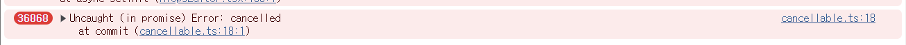
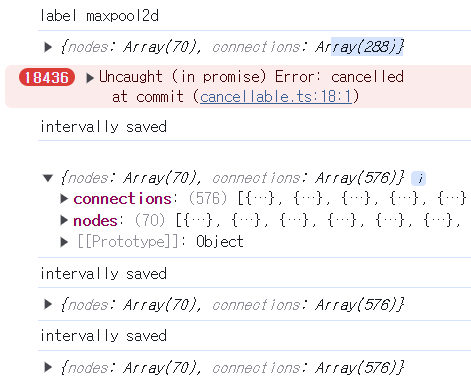
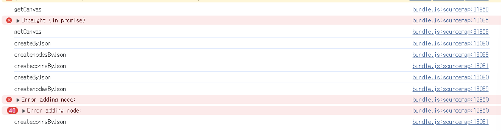
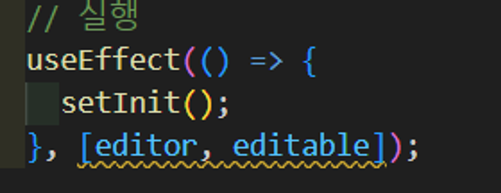
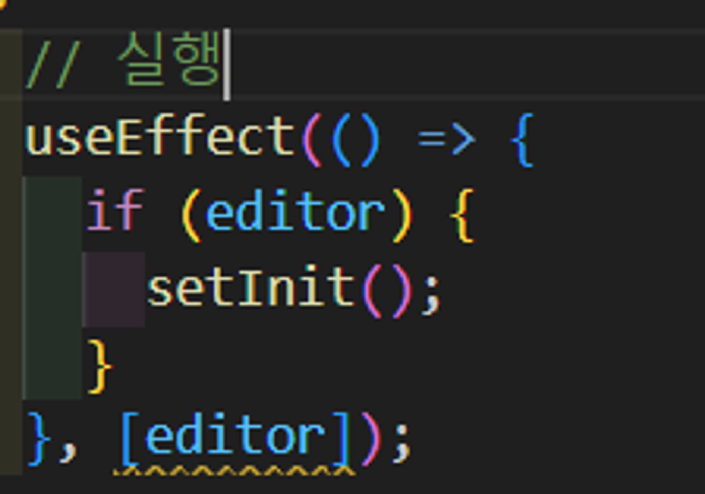
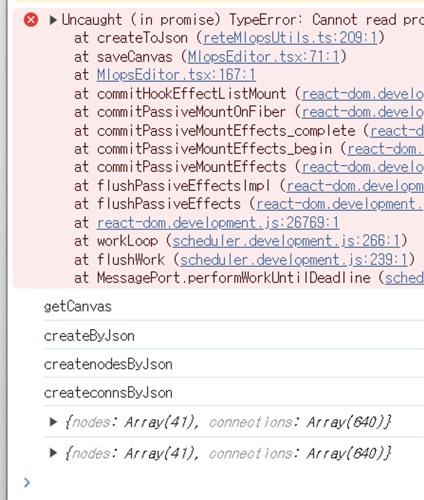
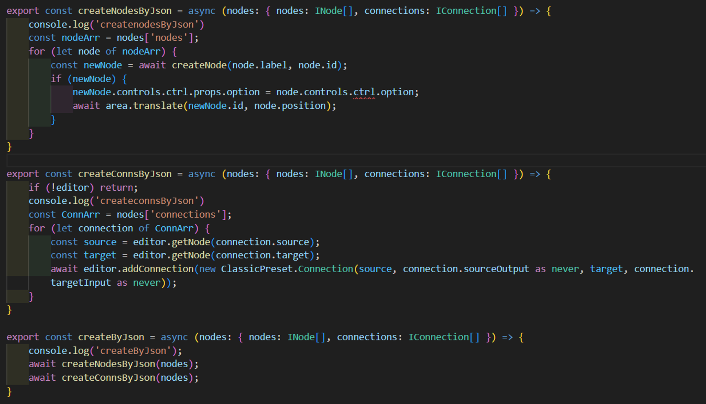

# createNode 함수에 try Catch 사용 시 cancelled 누적 에러

## 개요

createNode 함수는 주어진 label에 따라 그 종류의 node를 생성하고 addNode 함수에 생성한 노드를 전달하여 rete 에디터에 node를 추가하는 함수다. 이 때 addNode를 try catch문에 넣었더니, 새로고침 할 때마다 cancelled error가 딱 두 배씩 늘어나는 에러가 발생했다.

<!-- 왜지? 단순히 try catch가 문제가 아닐 것 같아 -->



<!-- 와..진짜 감도 안잡혀 뭐지............?? -->

## 문제 파악

### 의심 1. try catch

try catch는 run-time error만 잡아낼 수 있는데, 이를 exception, 예외라고 한다.
아예 런이 되지 않는 에러는 try catch가 잡아낼 수 없다.
이를 parse-time error라고 한다.

try catch는 동기적으로 동작하여 schecule 된 코드에서 발생한 예외는 try catch에서 잡아낼 수 없다.

예를 들어,

```js
try { 
  setTimeout(function() {
    noSuchVariable;
  }, 1000)
} catch {

}
```

엔진이 try catch를 떠난 다음에야 익명함수가 실행되므로 예외를 잡아낼 수 없다.

### 의심 2. 노드 누적

새로고침할 때마다 두 배 씩 늘어나는 걸로 봐서 노드가 누적 생성되는 것으로 추정.
rete의 destroy 함수가 editor가 unmount될 때 editor를 파괴시켜줬는데 작동하지 않는 것은 아닌지 다음의 코드를 추가해보았는데 효과가 없었다.

```js
  useEffect(() => {
    return () => {
      editor?.destroy();
    }
  }, [])
```

### 의심 3. process 함수 (cancelled error)

일단 uncaught cancelled error는 process함수에 있는 reset함수때문에 발생하는 것이기 때문에 이게 connection이 생길때마다 트리거되는 process함수와 관련된 것이라는 것을 알 수 있었다.

**여기서 connection이 불필요하게 생성되고 있다는 것을 알 수 있었다!!**



저장된 내역을 console로 뽑아보니, 새로고침 할 때마다 connection이 중복되어서 계속 생성되고 있었다. 그래서 딱 uncaught error도 두 배씩 늘 고 있었던 것이다. 근데 왜, connection이 중복되어 생성되며, try catch만 제외해봤을 때 동일한 에러가 재현되지 않는지 알아내야 했다.

### 의심 4 + 해결. getCanvas() 함수

그렇다면 남은 피의(?)자는 MlopsEditor 페이지를 새로 고침할 때, 문제가 발생하는 것으로 미루어보아, 처음 로딩할 때 실행되는 getCanvas() 함수가 잘 작동하는지 여부였다. console로 찍어본 결과 get Canvas가 두 번 실행되는 것을 발견했다.



여기서 문제의 진짜 원인을 발견할 수 있었다. **원인은 또 useEffect에 의존 배열을 제대로 작성해주지 않은 것이었다.** getCanvas() 함수를 포함한 setInit()함수가 호출되는 useEffect의 콜백함수를 호출하기 위한 조건, 의존배열에 editor와 editable이 들어가 있었는데,

editor는 createEditor라는 rete 내장함수로 생성되기 때문에 처음 앱이 로드 되었을 때 한 번, editor가 생성되었을 때 한 번, 바뀌기 때문에 setInit()이 두 번 실행되었던 것이다



setInit() 안에는 createNodes()와 createConnections()함수가 분리되어 있는데 전자만 try catch로 중단시키면서 노드는 추가되지 않았고, 그 이후에 connection은 중복을 검사하지 않고 생성하고 있었던 것이었다.

근데 setInit()이 두 번 실행되어서 getCanvas를 두 번 실행시키니까, BE에서 받아온 Json을 토대로 nodes랑 connections을 생성하는 함수도 두 번 실행되었는데, 노드는 노드 id도 같이 전달받아서 이미 id가 있는 노드면 추가할 때 rete자체에서 error를 생성하여서 중복되는 것을 방지해주었지만, conns는 애초에 저장할 때 conns id 도 같이 받질 않아서 다시 생성할 때 중복인지 체크할 id가 없었다.

그래서 두 번 실행되면 두 번 실행 되는 대로 conns를 생성해주고 있었던 것이다.

다음과 같이 의존 배열을 수정한 뒤에 connections의 개수가 늘어나지 않는 것을 확인했다.




<!--  -->

## 배운점

1. utils 함수의 try catch문에서 시작되어 page 컴포넌트의 setInit() 함수까지 도달하기 까지 여러 의심을 거듭한 결과 원인을 찾아냈을 때 원인이 또 useEffect의 의존 배열을 잘못 사용했던 것임을 알고 충격이 컸다. React를 제대로 공부해야할 것 같다.
1. 문제를 발생시킨 한 줄의 코드는 문제가 드러나게 한 것이지 근본적인 원인이 아닐 수 있다.
1. 문제를 끝까지 탐색해본 결과, 탐색 전에 내가 예상한 원인은 그 원인이 아닐 가능성이 매우 높다는 것을 알게 되었다.
