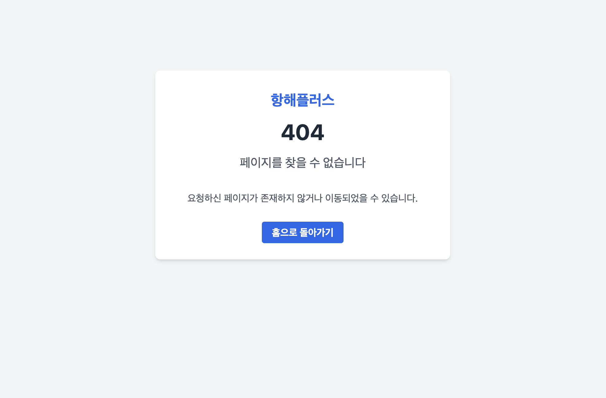

<!-- 수고 많았습니다. PR 셀프 회고에 올려준 내용을 바탕으로 피드백을 정리해봤습니다. 확인 해 주세요 :)

...배포했을 때 잘 동작하는지 확인하는 방법이 직접 배포를 해보는 방법 밖에 없어서 뭔가 하나 시도해보고 배포해서 확인해보고 하는 과정이 오래걸려서 너무 답답했습니다..

=> 배포가 익숙지 않으면 그럴수 있죠. 배포 환경이 낯설때에는 코드가 있는 상태에서 배포를 진행하기보다는 스타터 킷등을 이용해서 배포부터 우선 되는지 확인하고 (코드가 없으면 거의 대부분 어렵지 않게 됩니다.), 이후에 코드를 조금씩 추가해가면서 돌려보면 조금 더 편하게 접근할 수 있습니다.

... 코드를 설계할 때는 뭔가 Store에 페이지를 구독시키고, store의 상태가 변경되면 페이지가 리렌더링 되도록 하고 싶었는데, 구현하다보니까 라우터 내부에서 이벤트를 발생시키기도 하고 이벤트를 감지하기도 하게 돼서 그 역할 분리가 잘 안된 것 같아서 아쉽습니다.

=> 그러게요. 스스로 알고 있으니 해법도 금방 찾을거에요. 비즈니스 로직과 무관하게 라이브러리의 레이어라는게 있습니다. Store의 역할은 비즈니스 로직을 담는 것도 있지만 결국 Pus-Sub의 구조로 변화를 감지하고 구독하고 전파하는 역할이죠. 이러한 기능은 Observer Pattern을 통해서 구현이 가능하구요. 핵심 기능을 구현하는 것과 그 바탕에 비즈니스 로직을 올리는 것을 분리해서 구현할 줄 알게 되면 역할 분리를 잘 해낼 수 있을거라 기대합니다. 앞으로 과제에서 또 자주 만나게 되는 패턴이니 다음번에는 잘 적용해보길 바랍니다.

제너레이터 함수를 써보고 싶었어용.
페이지도 클래스로 만들고 기본 페이지 클래스를 상속하도록 구현하기
상태관리가 변경될 때 상태를 구독하고 있던 페이지가 리렌더링 되도록 구현하기

=> 좋아요. 꼭 한번 해보시길 바랍니다! 그렇지만 구독과 발행 모델이 제너레이터 함수와는 꼭 맞는 옷은 아니다 보니 제너레이터를 쓸 기회가 생기면 좋겠네요. :)

... 기능이 아니라 테스트에서 원하는게 무엇인지 디버깅 하면서 확인하는게 음 테스트를 위한 테스트 같다는 느낌이었습니당. 마음이 급해서 일단 터진데 막고보자는 식으로 테스트만 만족시키는 것을 목표로 했었는데, 리팩토링을 해보고 싶습니다.

=> 그게 TDD의 매력이죠! 그리고 리팩토링을 자신감있게 해줄 수 있는 원천이 되어 줍니다. 족쇄같다 생각할 수 있긴 한데 너무 거슬리면 그냥 없다고 생각하고 다 리팩토링하고 개발한 이후에 해버리고 테스트를 받는 것을 보너스 같은 느낌으로 활용해도 좋습니다. 

=> 그리고 어느정도 좋은 코드 패턴이 익숙해지면 리팩토링을 하지 않고서도 처음부터 좋은 구조로 빠르게 만들어갈 수 있을 거에요! 어떻게 하면 그렇게 할 수 있을지도 이번 9주동안 함께 고민해봐요.

...디버깅에 시간을 너무 많이 써서 이 시간을 단축시키려면 뭘 해야할지가 가장 고민입니다. 효율적으로 학습하고 싶어요.

=> 디버깅만 한다~ 라는 생각보다 리팩토링이나 코드를 정리하면서 디버깅도 겸해간다고 한번 모드를 바꿔보기를 바래요. 좋은 코드일수록 버그가 찾기도 쉽고 문제가 잘 발생하지도 않으니까요. 그러면 디버깅과 리팩토링 두 마리 토끼를 잡아가며 시간을 단축시킬수 있을거에요!

===
아직은 개념과 코딩과 적용을 하는 가운데서 아직 어떤 개발 기술들을 어디에 활용해야 하는지 익숙지 못한 거 같네요. 내가 배운 기술을 써야한다라는 생각보다는 문제를 해결하고 좋은 코드를 작성하는 것을 먼저 생각하고 그러기 위해서 필요한 기술이 뭔가를 찾아서 적합한 도구로써 기술을 매칭하는 식으로 그때 그때 필요한 것들을 찾아가면서 개발을 해볼 수 있게 되기를 바랍니다.

다행히 3팀에는 다양한 기술적 활용을 잘 하는 사람들이 있으니 접근법에 대해서는 함께 이야기를 해보면서 활용감각을 많이 높여보길 바래요! 화이팅입니다 :) -->

<aside style="padding: 12px 0; border-radius: 12px; background: #222222; border: 1px solid #ccc; color: white; white-space: pre-wrap;">

- **주간회고의 효능**
  - **한 번의 실수는 배움이, 두 번의 실수는 실력이 된다**
  → 개선 사항 추적과 리마인드를 통해 동일한 문제나 같은 실수를 반복하는 결과를 만들지 않습니다.
  - **경험이 없다면 창조도 없다**
  → 경험한 것을 기록해두면 더 잘 활용하기 위한 방법으로 연결시킬 수 있습니다.
  - **내가 틀릴 수 있다**
  → 끊임없는 회고를 통해 자기객관화를 달성하고,
  자신의 실수와 잘못을 인정할 줄 아는 용기 있는 사람이 됩니다.

</aside>

### 개요


이번 과제는 프레임워크 없이 JavaScript 만을 사용해서 라우터를 구현하는 것이었다. 과제 요구 사항은 여러가지가 있었다.

기본 동작은

- History API를 활용해 push state를 하고 그 때마다 root 컨테이너 div의 innerHTML 바꿔주는 render가 실행되는 것
- 로컬 스토리지에 로그인 된 user 정보를 저장하는 것
- 그에 따라 접근할 수 없는 경로를 지정하는 라우트 가드 기능

이었다.

심화 과제 요구사항으로는

- 다른 버튼 이벤트 처리도 부모 요소에서 버블링된 이벤트를 캡처하여 가능하게 하는 이벤트 위임
- 해시로도 라우팅이 가능하게 구현하기

등이 있었다.

> 해시라는 걸 처음 알게 되었는데, 보통은 하나의 페이지 안에 블록의 링크를 복사하거나 할 때 사용한다고 했다.
>
> ```JS
> https://www.example.com/path/page.html?query=value#section
> ```
  
  일단 기능 구현을 하려했다가, 테스트가 어려워서 테스트부터 통과되도록 하는 것을 목표로 했다.
  
### 문제 **(과제, 프로젝트를 진행하면서 부딪혔던 기술적인 문제)**

|sthgml.github.io/ |sthgml.github.io/front_end_5th_1-1/|
|--|--|
|||

가장 어려웠던 문제는 배포였다. 경로를 이동할 때마다 폴더 경로 뒤의 path만 바뀌는 것이 아닌 폴더 경로까지 통째로 교체되어서 자꾸만 내 깃헙 페이지의 루트 경로에 있는 이 블로그 페이지로 이동됐다. ㅋㅋㅋ 아니면 경로를 제대로 인식하지 못하고 ErrorPage가 떴다.

### 시도와 해결

```HTML
// as-is
<script type="module" src="/src/main.js"></script>

// to-be
<script type="module" src="./src/main.js"></script>
```

이게 가장 처음 적용했던 방법이다. index.html을 부르고 main.js를 부르는데 저걸 안해주면 main.js를 불러오는 것에서 부터 404가 떠서 아예 흰 페이지가 뜬다.

(실제경로: github.io/<폴더명>/main.js  
배포환경: github.io/main.js)

그래도 '/' 상태에서도 ErrorPage 가 렌더 된다. **내 앱은 지금 경로를 '/'가 아니라 '/front_end_5th_1-1/'로 알고 있기 때문이다.** 그래서 내 앱이 현재 배포 환경임을 알면 /front_end_5th_1-1 은 BASE_PATH 라는 것을 알고 이걸 뺀 나머지 경로를 기반으로 앱이 실행되어야 한다.

그래서 VITE_ENV 환경 변수를 설정해주었다.

```JS
export default ({ mode }) => {
  const env = loadEnv(mode, process.cwd(), "");

  return {
    test: {
      globals: true,
      environment: "jsdom",
      setupFiles: "./src/setupTests.js",
      exclude: ["**/e2e/**", "**/*.e2e.spec.js", "**/node_modules/**"],
    },
    base: env.VITE_BASE_URL,
  };
};
```

vite.config.js에 위의 코드처럼 env 를 불러올 수 있고, base를 설정해 줄 수 있다. 추가로 gh-pages 배포 자동화 yml을 추가한다.

```yml
name: Deploy

on:
  push:
    branches:
      - main

jobs:
  build-and-deploy:
    runs-on: ubuntu-latest
    permissions:
      contents: write
    steps:
      - name: Checkout
        uses: actions/checkout@v4

      - name: Install pnpm
        uses: pnpm/action-setup@v4
        with:
          version: 10

      - name: Install Node.js
        uses: actions/setup-node@v4
        with:
          node-version: 20
          cache: "pnpm"

      - name: Install dependencies
        run: pnpm install

      - name: Build
        run: pnpm build && cp 404.html dist/
        env:
          NODE_ENV: production

      - name: Deploy
        uses: peaceiris/actions-gh-pages@v4.0.0
        with:
          github_token: ${{ secrets.GITHUB_TOKEN }}
          publish_dir: ./dist
```

그리고 Router 객체에서도 path에서 걸러내고 추가하는 부분을 추가해 주었다.

history API로 경로를 이동했을 때 404.html을 사용할 수 있도록 빌드 폴더에 404.html을 넣어주는 동작이 yml에 포함되어 있다.

404.html에는 리다이렉트를 위한 스크립트가 포함되어 있다.

```JS
var segmentCount = 1;

var l = window.location;
l.replace(
  l.protocol + '//' + l.hostname + (l.port ? ':' + l.port : '') +
  l.pathname.split('/').slice(0, 1 + segmentCount).join('/') + '/?p=/' +
  l.pathname.slice(1).split('/').slice(segmentCount).join('/').replace(/&/g, '~and~') +
  (l.search ? '&q=' + l.search.slice(1).replace(/&/g, '~and~') : '') +
  l.hash
);
```

없는 경로로 인식되어 404.html이 로드되면 location에서 다음 경로에 기존 pathname 중 폴더 명 뒤에 /?p=/를 추가한 url로 변경시켜 준다는 내용이다.

그리고 저 /?p=/ 이 거슬린다면 팀원들의 코드를 리뷰하다가 알게된 것인데, 라우터에서 다시 빼줄 수도 있다!

```JS
    const params = new URLSearchParams(window.location.search);
    const redirectPath = params.get("p");
    if (redirectPath?.startsWith("/")) {
      return redirectPath;
    }
```

### **4. 알게된 것**

github pages 와 같은 간편하지만 한계가 있는 정적 배포 환경에서 SPA 서비스가 제대로 작동하도록 하려면 몇 가지 방법이 있다는 것.

배포환경과 개발환경을 명확하게 분리해서 사용할 수 있도록 해야한다는 것.

---

### **Keep : 현재 만족하고 계속 유지할 부분**

K1. 과제를 시작하기 전에 어떤 부분을 적용할 지 고민해보고 전체적인 그림을 그려 본 부분이 과제를 시작할 때 막막함을 덜어주는데 도움이 되었다.

### **Problem : 개선이 필요하다고 생각하는 문제점**

P1. 개별 테스트를 막으려고 하지말고 이 테스트와 관련된 다른 테스트에 미치는 영향력을 함께 고려하면서 코드를 발전시키자.

P2. 기술을 적용시키는 것을 먼저 생각하고 끼워 맞추려 한 것.

P3. 구현을 끝내고 배포한 것.

P4. 역할 분리가 되지 않음

### **Try : 문제점을 해결하기 위해 시도해야 할 것**

T1. 디버깅만 한다~ 라는 생각보다 리팩토링이나 코드를 정리하면서 디버깅도 겸해간다고 한번 모드를 바꿔보기 * 좋은 코드는 버그를 발견하기도 쉽다.

T2. 문제를 해결하고 좋은 코드를 작성하는 것을 먼저 생각하고 그러기 위해서 필요한 기술이 뭔가를 찾아서 적합한 도구로써 기술을 찾아보고 활용할 것

T3. 배포를 먼저하고 조금씩 구현하면서 제대로 작동하는지 확인할 것.

T4. 핵심 기능을 구현하는 것과 그 바탕에 비즈니스 로직을 올리는 것을 분리해서 구현
